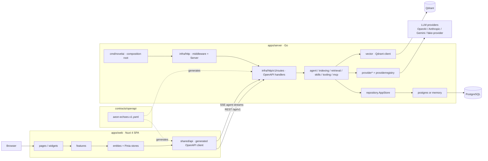

# Aeon Echoes

[English](./README.md) | [中文](./README.zh-CN.md)

**Aeon Echoes** is a long-form fiction writing workspace. It combines project management, versioned Story Bibles, chapter drafting, narrative knowledge graphs, and multi-role AI agents so you can plan, write, revise, and keep long novels consistent over time.

> Tagline: *A focused workspace for projects, Story Bibles, and long-form fiction writing.*

---

## Why Aeon Echoes

Writing a long novel is not only “generate more text”. Continuity breaks, forgotten promises, character drift, and lost world rules pile up as the manuscript grows. Aeon Echoes is built around that problem:

| Problem | How Aeon Echoes addresses it |
| --- | --- |
| Idea is messy at the start | Project seed → optional AI optimization → Story Bible |
| Canon drifts over time | Versioned Story Bible + atomic facts + continuity audit |
| Chapters need structure | Chapter lifecycle (`planned` → `drafting` → `reviewing` → `locked`) + versioned content |
| Models forget earlier books | Context packs (selected facts / entities / plot threads / summaries), not full-novel dumps |
| Knowledge is hard to navigate | Narrative graph (entities, edges, events, timelines) + semantic retrieval (Qdrant) |
| One model does everything poorly | Role-based agents (plot, character, writer, editor, fact extractor, graph curator, …) |
| Tools need to grow with the product | Builtin narrative tools + Skills + MCP servers |

---

## Core capabilities

### Writing workspace
- **Projects** with seed metadata (premise, genre, tone, audience, language, constraints, target chapters)
- **Story Bible** as the versioned canon document (logline, synopsis, themes, rules, linked entities / plot threads)
- **Chapter plan & editor** for long-form drafting
- **Chapter versions** with parent linkage (revision history, not overwrite-only)
- **Draft recovery** helpers in the web editor
- **Character profiles** generated from Story Bible and synced into the entity graph

### Narrative knowledge system
- **Entities**: characters, places, objects, factions, concepts, events, timeline nodes, …
- **Facts**: atomic, auditable claims with confidence, source, and chapter linkage
- **Graph edges**: relationships with type, label, weight, and evidence fact IDs
- **Plot threads**: open/closed narrative promises with priority and related entities
- **Worldlines**: timeline / canon variants without mixing facts across branches
- **Graph expansion** API for neighborhood retrieval
- **Semantic search** over vector-indexed context (Qdrant)

### AI agents & automation
Default seeded roles include:

| Role ID | Purpose |
| --- | --- |
| `genesis-optimizer` | Turn a project seed into a coherent Story Bible |
| `plot-architect` | Plan arcs, chapters, conflicts, narrative promises |
| `world-builder` | Maintain setting, rules, locations |
| `character-keeper` | Maintain character continuity, motives, secrets |
| `continuity-auditor` | Audit drafts against established facts |
| `writer` | Draft prose from context packs |
| `editor` | Revise / tighten prose without breaking canon |
| `fact-extractor` | Extract atomic facts after content changes |
| `graph-curator` | Refresh graph relations after extraction |

Agents support:
- Configurable system prompts, models, skills, tools, MCP servers
- **Streaming agent runs** (SSE)
- Tool-execution loops with persisted tool invocations
- **Context selection / preview** before generation
- Workflow tracking (`AIWorkflow` / `AIRun`) with model resolution metadata

### Model platform
- Provider types: `openai-responses`, `openai`, `anthropic`, `gemini`
- Separate **text** and **embedding** model kinds
- Provider CRUD, model refresh, routing weights, default-per-kind, role allowlists
- Optional provider request tracing with retention controls

### Extensibility
- **Skills**: inline text or directory-scanned skill sources
- **MCP**: stdio / streamable HTTP / SSE transports; connection test & tool refresh
- **Tools catalog**: builtin / MCP / skill-backed definitions with enable/disable
- Builtin narrative tools such as:
  - `character.search` / `character.upsert`
  - `relationship.search` / `relationship.upsert`
  - `event.search` / `event.upsert`
  - `timeline.range` / `timeline.node.upsert` / `create_before` / `create_after`
  - `plot_thread.search` / `plot_thread.upsert`
  - `chapter.list` / `chapter.get_range`
  - graph expansion and related narrative utilities

### Indexing & maintenance
- Background **index worker** after chapter content changes
- Deterministic knowledge extraction + vector upsert
- Index job queue, pending runs, vector index rebuild
- Index freshness status for operators and UI

### Product UI
SPA (Nuxt SPA mode) with:
- Dashboard / project library / new-project flow
- Project overview, writing editor, story graph explorer
- Settings: providers, models, agents, index maintenance
- Admin pages for agents & models
- Light / dark theme, zh-CN / en-US i18n

---

## Architecture

### System topology



### Request path

```text
Browser
  → pages / widgets / features
  → entities (Pinia) + shared/api (OpenAPI TS client)
  → HTTP /api/v1  (+ SSE for agent runs)
  → infra/http middleware (logging, CORS, request id)
  → v1/routes handlers (OpenAPI-generated interface)
  → domain services (agent, workflow, indexing, retrieval, skills, tooling, mcp)
  → repository.AppStore
      ├─ postgres  (default when AE_POSTGRES_DSN is set)
      └─ memory    (local fallback when DSN is empty)
  → side systems
      ├─ provider adapters → remote / fake LLM APIs
      └─ vector client → Qdrant collection `aeonechoes_context`
```

### Backend layers (`apps/server`)

| Layer | Packages | Responsibility |
| --- | --- | --- |
| Composition root | `cmd/novelai` | Load config, wire store / providers / workers, start HTTP |
| Transport | `internal/infra/http`, `.../v1/routes`, `.../v1/dto`, `.../v1/mappers`, `.../v1/openapi`, `.../v1/respond` | Middleware, OpenAPI handlers, DTO mapping, envelopes |
| Domain types | `internal/domain` | Shared business types and validation helpers |
| Application services | `internal/agent`, `indexing`, `retrieval`, `skills`, `tooling`, `mcp`, `extractor` | Workflows, agent runtime, tool loop, indexing, search, skills, MCP |
| Ports | `internal/repository`, `internal/provider` | Persistence and model-provider interfaces |
| Adapters | `internal/postgres`, `memory`, `provider/*`, `providerregistry`, `vector` | Concrete storage, LLM SDKs, Qdrant |
| Config | `internal/config` | Env loading and fail-fast validation |

Important wiring details:

- `repository.AppStore` is the single persistence surface used by HTTP handlers, agents, tools, context packing, and indexing.
- `agent.Runtime` / `WorkflowRunner` resolve models through `ModelRouter` + `providerregistry`, then run tool loops against `tooling.Registry`.
- `indexing.Worker` is optional background processing; routes can wake it after content changes.
- Without `AE_QDRANT_URL`, retrieval stays unavailable and indexing runs without vector upserts.

### Frontend layers (`apps/web`)

| Layer | Path | Responsibility |
| --- | --- | --- |
| Routes | `pages/` | File-based Nuxt routes |
| Page composition | `widgets/` | Large workspace assemblies (editor shell, assistant panel, …) |
| Use-cases | `features/` | Feature flows (create project, write chapter, run agent, …) |
| Domain state | `entities/*` | Entity API wrappers + Pinia stores |
| Shared kernel | `shared/api`, `shared/composables`, `shared/store` | Generated client, validation, request state |
| UI kit | `components/ui`, `components/layout`, … | Reusable presentation primitives |
| App shell | `layouts/`, `app.vue`, `stores/workspace.ts` | Shell chrome and cross-page workspace state |

Dependency direction is intentionally one-way:

```text
pages → widgets → features → entities → shared/api → /api/v1
```

### Deployed topology

| Environment | Topology |
| --- | --- |
| Local dev | Nuxt dev server + `go run ./cmd/novelai` + optional Docker `postgres` / `qdrant` / `fake-provider` |
| Compose prod-style | `web` (nginx static SPA, proxies `/api/` → app) + `app` (Go binary) + `postgres` + `qdrant` |
| Images | `ghcr.io/nekostash/aeonechoes/web`, `ghcr.io/nekostash/aeonechoes/app` |

### Design principles

1. **Contract-first API** — `contracts/openapi/aeon-echoes.v1.yaml` is the source of truth; Go handlers and TypeScript clients are generated from it.
2. **Fail fast** — invalid config, unsupported statuses, and broken infrastructure surface errors instead of silent fallbacks in core paths.
3. **Context packs, not novel dumps** — agents receive role-specific, budgeted context (facts, entities, edges, plot threads, chapter summaries).
4. **Immutable chapter versions** — chapter identity is stable; mutable prose lives in version rows.
5. **Role routing** — logical writing roles map to models/tools; operators still configure concrete agent instances.
6. **Optional infrastructure** — empty `AE_POSTGRES_DSN` selects the in-memory store; empty `AE_QDRANT_URL` disables Qdrant-backed retrieval.

---

## Repository layout

```text
AeonEchoes/
├── apps/
│   ├── server/                      # Go module: aeonechoes/server
│   │   ├── cmd/novelai/             # process entry / DI wiring
│   │   ├── internal/
│   │   │   ├── domain/              # domain types
│   │   │   ├── repository/          # AppStore port
│   │   │   ├── agent/               # roles, runtime, tool loop, workflows, audits
│   │   │   ├── indexing/            # index service + worker
│   │   │   ├── retrieval/           # semantic search
│   │   │   ├── skills/              # skill catalog / scan
│   │   │   ├── tooling/             # tool registry + builtin seed
│   │   │   ├── mcp/                 # MCP client
│   │   │   ├── extractor/           # deterministic knowledge extraction
│   │   │   ├── provider/            # LLM protocol adapters
│   │   │   ├── providerregistry/    # runtime provider factory registry
│   │   │   ├── postgres/            # AppStore + SQL migrations
│   │   │   ├── memory/              # in-memory AppStore
│   │   │   ├── vector/              # Qdrant adapter
│   │   │   ├── config/              # env config
│   │   │   └── infra/http/          # HTTP server + /api/v1 surface
│   │   │       └── v1/
│   │   │           ├── routes/      # OpenAPI handler implementations
│   │   │           ├── dto/         # transport DTOs
│   │   │           ├── mappers/     # domain ↔ DTO
│   │   │           ├── openapi/     # generated server bindings
│   │   │           ├── respond/     # envelopes / errors
│   │   │           ├── query/       # query helpers
│   │   │           └── shared/      # small route utilities
│   │   └── migrations/              # legacy / mirrored SQL notes
│   └── web/                         # package: @aeon-echoes/web
│       ├── pages/                   # routes
│       ├── widgets/                 # page-level compositions
│       ├── features/                # use-case modules
│       ├── entities/                # domain stores + API facades
│       ├── shared/                  # api client, composables, store helpers
│       ├── components/              # ui / layout / domain presentation
│       ├── layouts/ · stores/ · i18n/
│       └── tests/                   # vitest + playwright
├── contracts/openapi/               # OpenAPI 3.1 contract (v1)
├── infra/                           # Dockerfiles, nginx, fake-provider, env scripts
├── scripts/                         # local launchers
├── docker-compose.yml               # GHCR-based stack
├── docker-compose.dev.yml           # dev profiles
├── package.json                     # Yarn workspaces root
└── .env.example
```

---

## Tech stack

| Layer | Technology |
| --- | --- |
| Frontend | Nuxt 4, Vue 3, Pinia, Tailwind CSS, `@nuxtjs/i18n`, `@nuxtjs/color-mode`, Cytoscape, Lucide icons |
| API contract | OpenAPI 3.1 (`aeon-echoes.v1.yaml`), `@hey-api/openapi-ts`, Go `oapi-codegen` runtime |
| Backend | Go 1.26, net/http, structured `slog` logging |
| Persistence | PostgreSQL 16 + pgvector image, SQL migrations |
| Vectors | Qdrant (`aeonechoes_context` collection) |
| LLM SDKs | OpenAI Go SDK, Anthropic Go SDK, Google GenAI |
| Dev AI stub | Node fake-provider (OpenAI / Anthropic / Gemini shaped endpoints) |
| Tooling | Yarn 4 workspaces, Vitest, Playwright, Docker / Compose, GHCR publish workflow |
| Runtime | Node ≥ 20 (web), Go server binary `aeon-server` / local `cmd/novelai` |

---

## Domain model (high level)

```text
Project
  ├── seed (ProjectSeed)
  ├── StoryBible (versioned canon)
  ├── Worldlines
  ├── Entities ── GraphEdges ── Facts
  ├── PlotThreads
  ├── Chapters ── ChapterVersions (immutable content)
  ├── IndexJobs
  └── AIWorkflows / AIRuns / AgentRuns / ToolInvocations

Platform (global)
  ├── ProviderConfigs / ModelConfigs / ModelRouting
  ├── AgentConfigs / Skills / SkillSources
  ├── MCPServerConfigs / ToolDefinitions
  └── Settings
```

### Chapter lifecycle
`planned` → `drafting` → `reviewing` → `locked`

### API envelope
All successful v1 responses use:

```json
{ "data": ..., "meta": ... }
```

List responses also include pagination fields under `page`.

---

## HTTP API surface

Base path: **`/api/v1`**

Contract file: [`contracts/openapi/aeon-echoes.v1.yaml`](./contracts/openapi/aeon-echoes.v1.yaml)

Major groups (74 operations / 50 path templates):

| Group | Examples |
| --- | --- |
| System | health, system status |
| Projects | list/create/get, seed optimization |
| Story Bibles | current bible, update, character sync |
| Chapters | CRUD/patch, versions |
| Generation | context preview, chapter ideas, drafts, character profiles |
| Graph / Retrieval | graph expansions, semantic search |
| Workflows | list project workflows, get workflow |
| Providers / Models | CRUD, model refresh, routing |
| Agents | CRUD, run, stream run, run history |
| Skills | sources, scan, skill CRUD |
| MCP / Tools | servers, connection tests, tool refresh, tool catalog, invocations |
| Index | jobs, run pending, rebuild vector index |
| Settings | scoped key-value settings |

Generate clients after contract changes:

```bash
# TypeScript client for the web app
yarn generate:api

# Go OpenAPI bindings live under apps/server/internal/infra/http/v1/openapi
# (see generate.go / openapi.gen.go in that package)
```

---

## Quick start (local development)

### Prerequisites
- **Node.js** ≥ 20
- **Yarn** 4 (via Corepack)
- **Go** 1.26+ (see `apps/server/go.mod`)
- **Docker** (recommended for Postgres + Qdrant + fake provider)

### 1. Install dependencies

```bash
corepack enable
yarn install
```

### 2. Configure environment

```bash
cp .env.example .env
```

Important variables:

| Variable | Meaning |
| --- | --- |
| `AE_SERVER_HOST` / `AE_SERVER_PORT` | API bind address (default `127.0.0.1:8080`) |
| `AE_POSTGRES_DSN` | Postgres DSN; empty → in-memory store |
| `AE_QDRANT_URL` / `AE_QDRANT_API_KEY` | Vector store; empty disables Qdrant-backed retrieval |
| `AE_CORS_ALLOWED_ORIGINS` | Browser origins allowed by the API |
| `NUXT_PUBLIC_API_BASE` / `WEB_PUBLIC_API_BASE` | Web → API base (`http://localhost:8080/api/v1` in local dev) |
| `GO_BIN` | Optional path override for the Go toolchain |
| `OPENAI_API_KEY` / `ANTHROPIC_API_KEY` / `GEMINI_API_KEY` | Real providers when not using fake-provider |

### 3. Start infrastructure

```bash
# Postgres + Qdrant
yarn infra:base

# Optional deterministic fake AI (OpenAI / Anthropic / Gemini shaped)
yarn infra:fake-ai
```

### 4. Run API + web

```bash
# both
yarn dev

# or separately
yarn dev:server
yarn dev:web
```

Defaults:
- Web: `http://127.0.0.1:3000`
- API: `http://127.0.0.1:8080`
- Fake provider: `http://127.0.0.1:8787`
- Postgres: `5432`
- Qdrant: `6333`

### 5. First-run checklist
1. Open the web UI
2. Configure a **provider** (or point at fake-provider)
3. Refresh / create **models** and set routing defaults
4. Create a **project** from a seed
5. Edit the **Story Bible**, sync characters
6. Create chapters → generate plan/draft via agents
7. Explore the **story graph** and run **index maintenance** as needed

---

## Docker

### Production-style compose (`docker-compose.yml`)
Pulls / runs GHCR images:

- `ghcr.io/nekostash/aeonechoes/app`
- `ghcr.io/nekostash/aeonechoes/web`

Services: `postgres`, `qdrant`, `app`, `web`  
Web nginx proxies `/api/` → `app:8080`.

```bash
cp .env.example .env
# set POSTGRES_PASSWORD and any provider keys
docker compose up -d
```

### Development compose (`docker-compose.dev.yml`)
Profiles:
- `base` — postgres + qdrant
- `fake-ai` — fake-provider
- `app` / `web` — build local Dockerfiles

Images are also published from [`.github/workflows/ghcr.yml`](./.github/workflows/ghcr.yml) on `main` / version tags.

---

## Scripts reference

| Command | Description |
| --- | --- |
| `yarn dev` | Concurrent web + Go server |
| `yarn dev:web` | Nuxt dev server |
| `yarn dev:server` | `go run ./cmd/...` via `scripts/go-server.sh` |
| `yarn build:web` | Nuxt production build |
| `yarn generate:web` | Static generate (used by web Docker image) |
| `yarn generate:api` | Regenerate OpenAPI TypeScript client |
| `yarn typecheck:web` | Frontend typecheck |
| `yarn test:web` | All Vitest suites |
| `yarn test:web:unit` / `test:web:components` | Focused Vitest runs |
| `yarn test:web:e2e` | Playwright e2e (non-visual) |
| `yarn test:web:visual` | Playwright visual snapshots |
| `yarn test:server` | `go test ./...` |
| `yarn build:server` | Build server binary to `dist/server` |
| `yarn infra:base` / `infra:fake-ai` / `infra:down` | Dev Docker profiles |
| `yarn fake-provider` | Run fake provider without Docker |

---

## Testing

### Backend
```bash
yarn test:server
# or
sh ./scripts/go-server.sh test
```

Coverage areas include agent runtime/tool loop, workflows, continuity audit, providers, indexing, retrieval, Postgres mappers, and HTTP integration tests.

### Frontend
```bash
yarn test:web:unit
yarn test:web:components
yarn test:web:e2e
yarn test:web:visual
```

Playwright covers app shell, project authoring, writing editor, settings/graph flows, and visual regression.

---

## Configuration notes

Server config is loaded from environment variables (`apps/server/internal/config`). Selected knobs:

| Variable | Default | Purpose |
| --- | --- | --- |
| `AE_DATA_DIR` | `./data` | Local data directory |
| `AE_PROVIDER_TIMEOUT_SECONDS` | `60` | Default provider timeout |
| `AE_PROVIDER_TRACE_ENABLED` | `false` | Provider trace toggle |
| `AE_PROVIDER_TRACE_RETENTION_DAYS` | `14` | Trace retention |
| `AE_INDEX_WORKER_ENABLED` | `true` | Background indexing |
| `AE_INDEX_WORKER_INTERVAL_SECONDS` | `15` | Poll interval |
| `AE_INDEX_WORKER_BATCH_SIZE` | `10` | Batch size |
| `AE_SKILLS_DIR` | `./skills` | Skills scan directory |
| `AE_SKILLS_AUTO_SCAN` / `AE_SKILLS_SCAN_ON_START` | `true` | Skill discovery behavior |
| `AE_MCP_DEFAULT_TIMEOUT_SECONDS` | `60` | MCP default timeout |

---

## Frontend structure (Feature-Sliced style)

```text
apps/web/
  entities/     # project, chapter, story-bible, agent, model, graph, index-job
  features/     # project-create, chapter-write, graph-explore, agent-run, …
  widgets/      # writing-workspace, assistant-panel, chapter-tree, …
  pages/        # routes: /, /projects, /projects/:id/{editor,graph}, /settings/*
  components/   # reusable UI + layout
  shared/api/   # generated client, validation, error helpers
```

Key routes:

| Route | Purpose |
| --- | --- |
| `/` | Dashboard / home overview |
| `/projects` | Project library |
| `/projects/new` | Guided project creation |
| `/projects/:id` | Project overview |
| `/projects/:id/editor` | Writing workspace |
| `/projects/:id/graph` | Story graph explorer |
| `/settings/*` | Providers, models, agents, index maintenance |
| `/admin/*` | Admin agent/model management |

---

## Development status

Current workspace version: **0.1.0** (private monorepo).

The product is under active development. Expect API and UI churn while the OpenAPI contract remains the compatibility boundary for v1 clients.

---

## Contributing

1. Keep API changes in `contracts/openapi/aeon-echoes.v1.yaml` first, then regenerate clients.
2. Prefer interface-oriented server code under `internal/`; avoid ad-hoc super-services.
3. Add/adjust tests with behavior-level assertions (call real logic; do not only string-match source).
4. For local AI work without vendor keys, use `yarn infra:fake-ai` / `yarn fake-provider`.
5. Do not commit `.env`, secrets, `data/`, or generated screenshot artifacts under `artifacts/`.

---

## License

This repository is currently marked **private / UNLICENSED** in package manifests. Rights and distribution terms are reserved by the repository owner unless a license file is added later.

---

## Related links

- Repository: [https://github.com/NekoStash/AeonEchoes](https://github.com/NekoStash/AeonEchoes)
- Container images: `ghcr.io/nekostash/aeonechoes/app`, `ghcr.io/nekostash/aeonechoes/web`
- OpenAPI contract: [`contracts/openapi/aeon-echoes.v1.yaml`](./contracts/openapi/aeon-echoes.v1.yaml)
