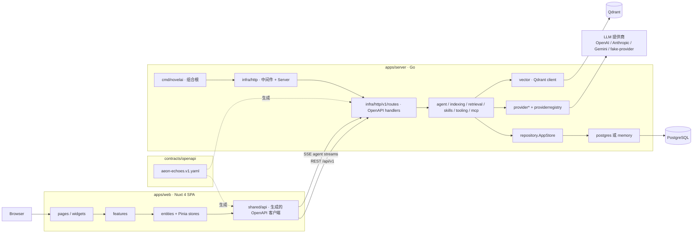

# Aeon Echoes（纪元回响）

[English](./README.md) | [中文](./README.zh-CN.md)

**Aeon Echoes** 是面向长篇小说创作的工作台。它把项目管理、版本化故事设定集（Story Bible）、章节写作、叙事知识图谱与多角色 AI 智能体整合在一起，帮助你在长周期创作中完成策划、写作、修订，并持续维护设定一致性。

> 产品一句话：**面向长篇小说创作的项目、故事设定集与写作工作台。**

---

## 为什么需要 Aeon Echoes

写长篇不只是「继续生成文字」。随着篇幅增长，连续性崩坏、伏笔遗忘、人物漂移、世界规则丢失会不断累积。Aeon Echoes 围绕这些问题设计：

| 痛点 | Aeon Echoes 的应对 |
| --- | --- |
| 开书时灵感杂乱 | 项目种子 → 可选 AI 优化 → Story Bible |
| 正典设定逐渐漂移 | 版本化 Story Bible + 原子事实 + 连续性审计 |
| 章节缺乏结构 | 章节生命周期（`planned` → `drafting` → `reviewing` → `locked`）+ 版本内容 |
| 模型记不住前文 | Context Pack（精选事实 / 实体 / 线索 / 摘要），而不是整本小说硬塞 |
| 知识难以检索与导航 | 叙事图谱（实体、关系、事件、时间线）+ 语义检索（Qdrant） |
| 单一模型包办一切效果差 | 按角色分工（策划、角色、写作、编辑、事实抽取、图谱维护等） |
| 工具能力需要随产品扩展 | 内置叙事工具 + Skills + MCP 服务器 |

---

## 核心能力

### 写作工作台
- **项目（Project）**：包含种子信息（前提、类型、基调、受众、语言、约束、目标章节数等）
- **Story Bible**：版本化正典文档（logline、梗概、主题、世界规则，以及关联实体 / 线索）
- **章节规划与编辑器**：支持长篇正文创作
- **章节版本**：带父子版本链路（修订历史，而非只能覆盖）
- **草稿恢复**：前端编辑器提供本地草稿恢复能力
- **角色档案**：可从 Story Bible 生成，并同步到实体图谱

### 叙事知识系统
- **实体（Entity）**：角色、地点、物品、势力、概念、事件、时间节点等
- **事实（Fact）**：可审计的原子断言，带置信度、来源与章节关联
- **关系边（GraphEdge）**：类型、标签、权重与证据事实 ID
- **情节线索（PlotThread）**：开闭状态的叙事承诺，含优先级与相关实体
- **世界线（Worldline）**：时间线 / 正典分支，避免跨线事实混用
- **图谱扩展 API**：按邻域检索相关节点
- **语义检索**：基于向量索引的上下文搜索（Qdrant）

### AI 智能体与自动化
默认预置角色包括：

| 角色 ID | 职责 |
| --- | --- |
| `genesis-optimizer` | 将项目种子整理为连贯 Story Bible |
| `plot-architect` | 规划主线、章节、冲突与叙事承诺 |
| `world-builder` | 维护设定、规则与地点 |
| `character-keeper` | 维护角色连续性、动机与秘密 |
| `continuity-auditor` | 对照既有事实审计草稿连续性 |
| `writer` | 基于 Context Pack 撰写正文 |
| `editor` | 润色/修订文本，不破坏正典 |
| `fact-extractor` | 在内容变更后抽取原子事实 |
| `graph-curator` | 抽取后刷新图谱关系 |

智能体支持：
- 可配置系统提示词、模型、技能、工具、MCP 服务器
- **流式 Agent 运行**（SSE）
- 工具执行循环，并持久化工具调用记录
- 生成前的 **上下文选择 / 预览**
- 工作流追踪（`AIWorkflow` / `AIRun`）与模型路由解析元数据

### 模型平台
- 提供商类型：`openai-responses`、`openai`、`anthropic`、`gemini`
- 区分 **文本模型** 与 **嵌入模型**
- 提供商 CRUD、模型刷新、路由权重、按类型默认模型、角色白名单
- 可选请求追踪与保留天数控制

### 可扩展性
- **Skills**：支持内联文本或目录扫描型技能源
- **MCP**：stdio / streamable HTTP / SSE 传输；连接测试与工具刷新
- **工具目录**：builtin / MCP / skill 三类定义，可启用/禁用
- 内置叙事工具示例：
  - `character.search` / `character.upsert`
  - `relationship.search` / `relationship.upsert`
  - `event.search` / `event.upsert`
  - `timeline.range` / `timeline.node.upsert` / `create_before` / `create_after`
  - `plot_thread.search` / `plot_thread.upsert`
  - `chapter.list` / `chapter.get_range`
  - 以及图谱扩展等相关叙事工具

### 索引与运维
- 章节内容变更后的后台 **索引 Worker**
- 确定性知识抽取 + 向量写入
- 索引任务队列、待处理任务执行、向量索引重建
- 索引新鲜度状态，供运营与 UI 展示

### 产品界面
Nuxt SPA 模式前端，包含：
- 工作台 / 项目库 / 新建项目流程
- 项目概览、写作编辑器、故事关系图谱
- 设置：提供商、模型、智能体、索引维护
- 管理页：智能体与模型
- 明暗主题，中英双语（zh-CN / en-US）

---

## 架构

### 系统拓扑



### 请求路径

```text
Browser
  → pages / widgets / features
  → entities（Pinia）+ shared/api（OpenAPI TS 客户端）
  → HTTP /api/v1  （Agent 运行为 SSE）
  → infra/http 中间件（logging、CORS、request id）
  → v1/routes handlers（OpenAPI 生成接口实现）
  → 领域服务（agent、workflow、indexing、retrieval、skills、tooling、mcp）
  → repository.AppStore
      ├─ postgres  （设置 AE_POSTGRES_DSN 时）
      └─ memory    （DSN 为空时的本地回退）
  → 旁路系统
      ├─ provider 适配器 → 远程 / 假 LLM API
      └─ vector 客户端 → Qdrant 集合 `aeonechoes_context`
```

### 后端分层（`apps/server`）

| 分层 | 包路径 | 职责 |
| --- | --- | --- |
| 组合根 | `cmd/novelai` | 加载配置，装配 store / providers / worker，启动 HTTP |
| 传输层 | `internal/infra/http`、`.../v1/routes`、`dto`、`mappers`、`openapi`、`respond` | 中间件、OpenAPI handlers、DTO 映射、响应信封 |
| 领域类型 | `internal/domain` | 共享业务类型与校验 |
| 应用服务 | `internal/agent`、`indexing`、`retrieval`、`skills`、`tooling`、`mcp`、`extractor` | 工作流、Agent 运行时、工具循环、索引、检索、技能、MCP |
| 端口 | `internal/repository`、`internal/provider` | 持久化与模型提供商接口 |
| 适配器 | `internal/postgres`、`memory`、`provider/*`、`providerregistry`、`vector` | 具体存储、LLM SDK、Qdrant |
| 配置 | `internal/config` | 环境变量加载与 Fail Fast 校验 |

关键接线：

- `repository.AppStore` 是 HTTP、Agent、工具、Context Pack 与索引共用的唯一持久化面。
- `agent.Runtime` / `WorkflowRunner` 通过 `ModelRouter` + `providerregistry` 解析模型，再经 `tooling.Registry` 执行工具循环。
- `indexing.Worker` 为可选后台任务；路由可在内容变更后唤醒它。
- 未配置 `AE_QDRANT_URL` 时，语义检索不可用，索引也不会写入向量。

### 前端分层（`apps/web`）

| 分层 | 路径 | 职责 |
| --- | --- | --- |
| 路由 | `pages/` | Nuxt 文件路由 |
| 页面组合 | `widgets/` | 大型工作区装配（编辑器壳、助手面板等） |
| 用例 | `features/` | 功能流（建项目、写章节、跑 Agent 等） |
| 领域状态 | `entities/*` | 实体 API 封装 + Pinia store |
| 共享内核 | `shared/api`、`shared/composables`、`shared/store` | 生成客户端、校验、请求状态 |
| UI 套件 | `components/ui`、`components/layout` 等 | 可复用展示组件 |
| 应用壳 | `layouts/`、`app.vue`、`stores/workspace.ts` | 壳层导航与跨页工作区状态 |

依赖方向单向：

```text
pages → widgets → features → entities → shared/api → /api/v1
```

### 部署拓扑

| 环境 | 拓扑 |
| --- | --- |
| 本地开发 | Nuxt dev + `go run ./cmd/novelai` + 可选 Docker `postgres` / `qdrant` / `fake-provider` |
| Compose 生产风格 | `web`（nginx 静态 SPA，`/api/` 反代到 app）+ `app`（Go 二进制）+ `postgres` + `qdrant` |
| 镜像 | `ghcr.io/nekostash/aeonechoes/web`、`ghcr.io/nekostash/aeonechoes/app` |

### 设计原则

1. **契约优先 API** — `contracts/openapi/aeon-echoes.v1.yaml` 为事实来源；Go handlers 与 TypeScript 客户端均由契约生成。
2. **Fail Fast** — 非法配置、不受支持的状态、基础设施异常应尽早报错，核心路径避免静默兜底。
3. **Context Pack，而非整本小说** — 智能体只拿按角色与 token 预算裁剪后的上下文。
4. **章节版本不可变** — 章节身份稳定，可变正文落在版本表。
5. **角色路由** — 逻辑写作角色映射到模型/工具；运营仍可配置具体 Agent 实例。
6. **基础设施可选** — `AE_POSTGRES_DSN` 为空时使用内存存储；`AE_QDRANT_URL` 为空时关闭 Qdrant 语义检索。

---

## 仓库结构

```text
AeonEchoes/
├── apps/
│   ├── server/                      # Go module: aeonechoes/server
│   │   ├── cmd/novelai/             # 进程入口 / 依赖装配
│   │   ├── internal/
│   │   │   ├── domain/              # 领域类型
│   │   │   ├── repository/          # AppStore 端口
│   │   │   ├── agent/               # 角色、运行时、工具循环、工作流、审计
│   │   │   ├── indexing/            # 索引服务 + worker
│   │   │   ├── retrieval/           # 语义检索
│   │   │   ├── skills/              # 技能目录 / 扫描
│   │   │   ├── tooling/             # 工具注册 + 内置播种
│   │   │   ├── mcp/                 # MCP 客户端
│   │   │   ├── extractor/           # 确定性知识抽取
│   │   │   ├── provider/            # LLM 协议适配
│   │   │   ├── providerregistry/    # 运行时 provider 工厂注册
│   │   │   ├── postgres/            # AppStore + SQL 迁移
│   │   │   ├── memory/              # 内存 AppStore
│   │   │   ├── vector/              # Qdrant 适配
│   │   │   ├── config/              # 环境配置
│   │   │   └── infra/http/          # HTTP 服务 + /api/v1
│   │   │       └── v1/
│   │   │           ├── routes/      # OpenAPI handler 实现
│   │   │           ├── dto/         # 传输 DTO
│   │   │           ├── mappers/     # domain ↔ DTO
│   │   │           ├── openapi/     # 生成的服务端绑定
│   │   │           ├── respond/     # 信封 / 错误
│   │   │           ├── query/       # 查询辅助
│   │   │           └── shared/      # 路由小工具
│   │   └── migrations/              # 历史 / 镜像 SQL 说明
│   └── web/                         # package: @aeon-echoes/web
│       ├── pages/                   # 路由
│       ├── widgets/                 # 页面级组合
│       ├── features/                # 用例模块
│       ├── entities/                # 领域 store + API 门面
│       ├── shared/                  # api 客户端、composables、store 辅助
│       ├── components/              # ui / layout / 领域展示
│       ├── layouts/ · stores/ · i18n/
│       └── tests/                   # vitest + playwright
├── contracts/openapi/               # OpenAPI 3.1 契约（v1）
├── infra/                           # Dockerfile、nginx、fake-provider、环境脚本
├── scripts/                         # 本地启动器
├── docker-compose.yml               # GHCR 栈
├── docker-compose.dev.yml           # 开发 profile
├── package.json                     # Yarn workspaces 根
└── .env.example
```

---

## 技术栈

| 层级 | 技术 |
| --- | --- |
| 前端 | Nuxt 4、Vue 3、Pinia、Tailwind CSS、`@nuxtjs/i18n`、`@nuxtjs/color-mode`、Cytoscape、Lucide |
| API 契约 | OpenAPI 3.1（`aeon-echoes.v1.yaml`）、`@hey-api/openapi-ts`、Go `oapi-codegen` runtime |
| 后端 | Go 1.26、net/http、结构化 `slog` 日志 |
| 持久化 | PostgreSQL 16 + pgvector 镜像，SQL 迁移 |
| 向量 | Qdrant（集合 `aeonechoes_context`） |
| LLM SDK | OpenAI Go SDK、Anthropic Go SDK、Google GenAI |
| 开发假 AI | Node fake-provider（兼容 OpenAI / Anthropic / Gemini 形态） |
| 工程工具 | Yarn 4 workspaces、Vitest、Playwright、Docker / Compose、GHCR 发布工作流 |
| 运行时 | Node ≥ 20（前端）、Go 服务二进制 `aeon-server` / 本地 `cmd/novelai` |

---

## 领域模型（高层）

```text
Project
  ├── seed（ProjectSeed）
  ├── StoryBible（版本化正典）
  ├── Worldlines
  ├── Entities ── GraphEdges ── Facts
  ├── PlotThreads
  ├── Chapters ── ChapterVersions（不可变正文）
  ├── IndexJobs
  └── AIWorkflows / AIRuns / AgentRuns / ToolInvocations

平台（全局）
  ├── ProviderConfigs / ModelConfigs / ModelRouting
  ├── AgentConfigs / Skills / SkillSources
  ├── MCPServerConfigs / ToolDefinitions
  └── Settings
```

### 章节生命周期
`planned` → `drafting` → `reviewing` → `locked`

### API 响应信封
所有成功的 v1 响应使用：

```json
{ "data": ..., "meta": ... }
```

列表响应还包含 `page` 分页信息。

---

## HTTP API 能力面

基础路径：**`/api/v1`**

契约文件：[`contracts/openapi/aeon-echoes.v1.yaml`](./contracts/openapi/aeon-echoes.v1.yaml)

主要分组（约 74 个 operation / 50 个 path 模板）：

| 分组 | 示例 |
| --- | --- |
| 系统 | health、system status |
| 项目 | 列表/创建/查询、种子优化 |
| Story Bible | 当前设定集、更新、角色同步 |
| 章节 | CRUD/patch、版本列表与创建 |
| 生成 | 上下文预览、章节构思、草稿、角色档案 |
| 图谱 / 检索 | 图谱扩展、语义搜索 |
| 工作流 | 项目工作流列表、查询工作流 |
| 提供商 / 模型 | CRUD、模型刷新、路由 |
| 智能体 | CRUD、运行、流式运行、运行历史 |
| 技能 | 技能源、扫描、技能 CRUD |
| MCP / 工具 | 服务器、连接测试、工具刷新、工具目录、调用记录 |
| 索引 | 任务、执行待处理、向量索引重建 |
| 设置 | 作用域键值设置 |

契约变更后重新生成客户端：

```bash
# Web 端 TypeScript 客户端
yarn generate:api

# Go OpenAPI 绑定位于 apps/server/internal/infra/http/v1/openapi
# （见该包下 generate.go / openapi.gen.go）
```

---

## 快速开始（本地开发）

### 前置条件
- **Node.js** ≥ 20
- **Yarn** 4（推荐 Corepack）
- **Go** 1.26+（见 `apps/server/go.mod`）
- **Docker**（推荐用于 Postgres + Qdrant + fake provider）

### 1. 安装依赖

```bash
corepack enable
yarn install
```

### 2. 配置环境变量

```bash
cp .env.example .env
```

关键变量：

| 变量 | 含义 |
| --- | --- |
| `AE_SERVER_HOST` / `AE_SERVER_PORT` | API 监听地址（默认 `127.0.0.1:8080`） |
| `AE_POSTGRES_DSN` | Postgres 连接串；为空则使用内存存储 |
| `AE_QDRANT_URL` / `AE_QDRANT_API_KEY` | 向量库；为空则关闭 Qdrant 语义检索 |
| `AE_CORS_ALLOWED_ORIGINS` | 允许跨域的前端来源 |
| `NUXT_PUBLIC_API_BASE` / `WEB_PUBLIC_API_BASE` | 前端 API 基址（本地开发一般为 `http://localhost:8080/api/v1`） |
| `GO_BIN` | 可选，指定 Go 工具链路径 |
| `OPENAI_API_KEY` / `ANTHROPIC_API_KEY` / `GEMINI_API_KEY` | 不使用 fake-provider 时的真实密钥 |

### 3. 启动基础设施

```bash
# Postgres + Qdrant
yarn infra:base

# 可选：确定性假 AI（OpenAI / Anthropic / Gemini 形态）
yarn infra:fake-ai
```

### 4. 启动 API + Web

```bash
# 同时启动
yarn dev

# 或分别启动
yarn dev:server
yarn dev:web
```

默认端口：
- Web：`http://127.0.0.1:3000`
- API：`http://127.0.0.1:8080`
- Fake provider：`http://127.0.0.1:8787`
- Postgres：`5432`
- Qdrant：`6333`

### 5. 首次使用清单
1. 打开 Web 界面
2. 配置 **提供商**（或指向 fake-provider）
3. 刷新/创建 **模型**，设置路由默认值
4. 用种子 **创建项目**
5. 编辑 **Story Bible**，同步角色
6. 创建章节 → 通过智能体生成构思/草稿
7. 浏览 **关系图谱**，必要时执行 **索引维护**

---

## Docker

### 生产风格编排（`docker-compose.yml`）
使用 GHCR 镜像：

- `ghcr.io/nekostash/aeonechoes/app`
- `ghcr.io/nekostash/aeonechoes/web`

服务：`postgres`、`qdrant`、`app`、`web`  
Web 容器内 nginx 将 `/api/` 反代到 `app:8080`。

```bash
cp .env.example .env
# 设置 POSTGRES_PASSWORD 与所需提供商密钥
docker compose up -d
```

### 开发编排（`docker-compose.dev.yml`）
Profiles：
- `base` — postgres + qdrant
- `fake-ai` — fake-provider
- `app` / `web` — 本地 Dockerfile 构建

镜像也会由 [`.github/workflows/ghcr.yml`](./.github/workflows/ghcr.yml) 在 `main` / 版本标签推送时发布。

---

## 脚本一览

| 命令 | 说明 |
| --- | --- |
| `yarn dev` | 并发启动 Web + Go 服务 |
| `yarn dev:web` | Nuxt 开发服务器 |
| `yarn dev:server` | 通过 `scripts/go-server.sh` 执行 `go run ./cmd/...` |
| `yarn build:web` | Nuxt 生产构建 |
| `yarn generate:web` | 静态导出（Web Docker 镜像使用） |
| `yarn generate:api` | 重新生成 OpenAPI TypeScript 客户端 |
| `yarn typecheck:web` | 前端类型检查 |
| `yarn test:web` | 全部 Vitest |
| `yarn test:web:unit` / `test:web:components` | 分套件 Vitest |
| `yarn test:web:e2e` | Playwright e2e（非视觉） |
| `yarn test:web:visual` | Playwright 视觉回归 |
| `yarn test:server` | `go test ./...` |
| `yarn build:server` | 构建服务端二进制到 `dist/server` |
| `yarn infra:base` / `infra:fake-ai` / `infra:down` | 开发 Docker profile |
| `yarn fake-provider` | 不经过 Docker 启动假提供商 |

---

## 测试

### 后端
```bash
yarn test:server
# 或
sh ./scripts/go-server.sh test
```

覆盖范围包括：agent 运行时/工具循环、工作流、连续性审计、提供商适配、索引、检索、Postgres 映射与 HTTP 集成测试。

### 前端
```bash
yarn test:web:unit
yarn test:web:components
yarn test:web:e2e
yarn test:web:visual
```

Playwright 覆盖应用壳、项目创作、写作编辑器、设置/图谱流程，以及视觉回归。

---

## 配置说明

服务端配置从环境变量加载（`apps/server/internal/config`）。部分关键项：

| 变量 | 默认值 | 用途 |
| --- | --- | --- |
| `AE_DATA_DIR` | `./data` | 本地数据目录 |
| `AE_PROVIDER_TIMEOUT_SECONDS` | `60` | 默认提供商超时 |
| `AE_PROVIDER_TRACE_ENABLED` | `false` | 提供商追踪开关 |
| `AE_PROVIDER_TRACE_RETENTION_DAYS` | `14` | 追踪保留天数 |
| `AE_INDEX_WORKER_ENABLED` | `true` | 后台索引 |
| `AE_INDEX_WORKER_INTERVAL_SECONDS` | `15` | 轮询间隔 |
| `AE_INDEX_WORKER_BATCH_SIZE` | `10` | 批大小 |
| `AE_SKILLS_DIR` | `./skills` | 技能扫描目录 |
| `AE_SKILLS_AUTO_SCAN` / `AE_SKILLS_SCAN_ON_START` | `true` | 技能发现行为 |
| `AE_MCP_DEFAULT_TIMEOUT_SECONDS` | `60` | MCP 默认超时 |

---

## 前端结构（偏 Feature-Sliced）

```text
apps/web/
  entities/     # project、chapter、story-bible、agent、model、graph、index-job
  features/     # project-create、chapter-write、graph-explore、agent-run 等
  widgets/      # writing-workspace、assistant-panel、chapter-tree 等
  pages/        # 路由：/、/projects、/projects/:id/{editor,graph}、/settings/*
  components/   # 可复用 UI 与布局
  shared/api/   # 生成客户端、校验、错误辅助
```

主要路由：

| 路由 | 用途 |
| --- | --- |
| `/` | 工作台首页 |
| `/projects` | 项目库 |
| `/projects/new` | 引导式新建项目 |
| `/projects/:id` | 项目概览 |
| `/projects/:id/editor` | 写作工作区 |
| `/projects/:id/graph` | 故事关系图谱 |
| `/settings/*` | 提供商、模型、智能体、索引维护 |
| `/admin/*` | 管理端智能体/模型 |

---

## 开发状态

当前工作区版本：**0.1.0**（私有 monorepo）。

项目仍在积极开发中。在 v1 客户端兼容边界内，OpenAPI 契约是主要兼容面；UI 与内部实现可能持续演进。

---

## 贡献建议

1. API 变更先改 `contracts/openapi/aeon-echoes.v1.yaml`，再生成客户端。
2. 服务端优先面向接口放在 `internal/`；避免堆砌超级服务对象。
3. 测试用行为级断言验证逻辑（直接调用代码），不要只做源码字符串匹配。
4. 本地无厂商密钥时，使用 `yarn infra:fake-ai` / `yarn fake-provider`。
5. 不要提交 `.env`、密钥、`data/`，以及 `artifacts/` 下的截图/临时产物。

---

## 许可证

本项目采用 **GNU Affero General Public License v3.0 only**（`AGPL-3.0-only`）授权。

完整文本见 [`LICENSE`](./LICENSE)。

简要说明：你可以在 AGPLv3 条款下使用、研究、分享与修改本软件。若你将修改后的版本作为网络服务运行，还必须向该服务的使用者提供对应的完整源代码。

---

## 相关链接

- 仓库：[https://github.com/NekoStash/AeonEchoes](https://github.com/NekoStash/AeonEchoes)
- 容器镜像：`ghcr.io/nekostash/aeonechoes/app`、`ghcr.io/nekostash/aeonechoes/web`
- OpenAPI 契约：[`contracts/openapi/aeon-echoes.v1.yaml`](./contracts/openapi/aeon-echoes.v1.yaml)
